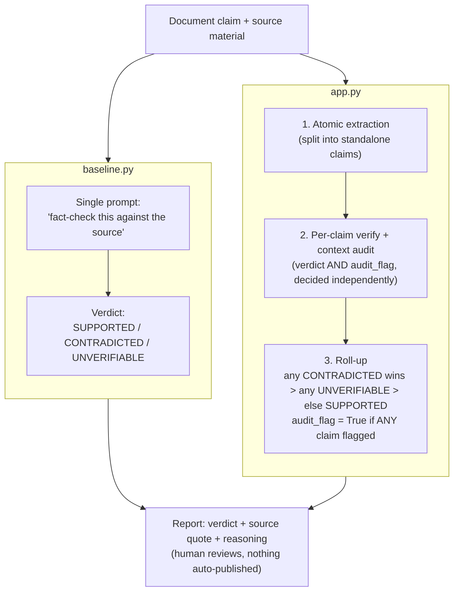

# Claim Verifier — Financial & Corporate Communications

An agent that checks factual claims in corporate documents against source
material — and catches the failure mode most reviewers miss: claims that
are *technically true but deceptively framed*.

📖 [Documentation hub](docs/index.html) — an overview page linking to a
[full report](docs/report.html) covering architecture, real test results,
security/CI rationale, reproducibility, and the changelog (open
`docs/index.html` directly in a browser, or enable GitHub Pages on this
repo to view it hosted).

---

## Table of contents
- [🎯 The problem](#-the-problem)
- [🏦 Domain](#-domain)
- [🤖 AI agent disclosure](#-ai-agent-disclosure)
- [🧱 What existed before vs. what I built](#-what-existed-before-vs-what-i-built)
- [⚙️ How it works](#️-how-it-works)
- [🚫 What this system does not do](#-what-this-system-does-not-do)
- [📊 Results](#-results)
- [📓 Improvement changelog](#-improvement-changelog)
- [🔁 Reproduction](#-reproduction)
- [🔒 Security](#-security)

---

## 🎯 The problem
Content teams, financial analysts, investor-relations staff, and
journalists reviewing corporate documents — earnings summaries, press
releases, internal reports — check each claim against source material by
eye. The hardest errors to catch aren't outright lies: they're claims that
are technically true but deceptively framed. A number that's real, but
whose context (test conditions, time period, population it applies to)
has been quietly changed or dropped, making an accurate number misleading.
A tired human reviewer — or a plain AI asked "is this accurate?" — sees
the number match and waves the claim through. That's exactly the class of
error that causes real reputational and financial harm: a correct-sounding
statistic used to imply something the underlying data doesn't support.

## 🏦 Domain
Scoped specifically to **financial and corporate communications** —
earnings claims, internal metrics, press statements. Chosen deliberately:
it gives exact, unambiguous ground truth (a number either matches a
filing/report or it doesn't), and it's one of the domain areas micro1
itself works in.

## 🤖 AI agent disclosure
Built using **Claude Code (Anthropic)** as the coding agent throughout
development. Representative session trajectories — instructions given,
actions taken, tool responses, and human review checkpoints — are in
`trajectories/`, as required by the hackathon rules. The verification
pipeline itself (`app.py`) runs on a separate, local open-weight model via
Ollama — see [How it works](#️-how-it-works).

## 🧱 What existed before vs. what I built
| Existed before this project | Built during this project |
|---|---|
| Python 3.12, Docker, Docker Compose | The two-step verification pipeline (`app.py`) |
| Ollama (open-source local model runner) | The baseline comparison (`baseline.py`) |
| The `llama3.2` open-weight model (third-party, pre-trained) | The evaluation harness (`evaluate.py`) |
| Pydantic, pytest, ruff, bandit, gitleaks, Trivy, hadolint (all third-party tools) | All 10 test cases and their ground-truth verdicts |
| Claude Code (coding agent used to build this — see `trajectories/`) | The CI gate configuration, README, changelog, and reproduction guide |

## ⚙️ How it works
**Baseline** (`baseline.py`): one direct prompt — "fact-check this document
against this source material" — no structural decomposition, no context
audit.

**This system** (`app.py`):
1. **Atomic extraction** — splits a document into individual, standalone
   factual claims (numbers, quotes, historical facts) instead of judging
   the whole document as one blob.
2. **Verification + context audit** — for each claim, returns a
   structured verdict (`SUPPORTED` / `CONTRADICTED` / `UNVERIFIABLE`) plus
   a separate `context_audit_flag`, decided independently, that catches
   claims where the number is correct but the surrounding context has
   been altered or omitted.
3. **Report** — every verdict includes the source quote it's based on and
   the model's reasoning, so a human editor can check the agent's work
   rather than trust it outright.



Both run on the identical set of 10 test cases in `test_cases/`. No
retrieval framework, vector database, or agent-orchestration library —
source material is provided directly per case, and both pipelines are
plain HTTP calls to a local, free, open-weight model served via
[Ollama](https://ollama.com). No API key, no billing account, no signup
required anywhere in this project.

**Optional web UI** — a thin Flask page over the same pipeline (no new
verification logic): paste, or drag-and-drop a `.txt`/`.pdf`/`.docx` file
for, a claim and its source, and see baseline vs. verifier side by side.

```bash
pip install -r requirements.txt
python web/server.py
# then open http://127.0.0.1:5000
```

## 🚫 What this system does not do
- Does not determine intent — it never concludes "this is fraud" or
  "someone lied," only "this doesn't match the source" or "context was
  altered."
- Does not fact-check subjective opinions or forward-looking predictions.
- Does not publish, flag publicly, or take any action on its own — every
  result is a report for a human editor to review and decide on.
- Does not search the open internet for source material — it verifies
  against source material the user explicitly provides.

## 📊 Results
Real numbers from the latest `evaluate.py` run, reproduced twice
(byte-identical — see `evidence/results_run1.md` vs `results_run2.md`):

| | Baseline | Verifier |
|---|---|---|
| Verdict accuracy | 7/10 | 7/10 |
| Context-audit-flag accuracy | — (no mechanism) | 7/10 |
| Fully correct (verdict *and* audit flag) | — | 4/10 |

Raw verdict accuracy is tied — the verifier's real advantage is the
audit-flag dimension the baseline has no mechanism for at all, including
getting the key differentiator case (deceptive context) fully correct.
See `evidence/results.md` for the full per-case breakdown, generated by
actually running `evaluate.py`, not written in advance.

## 📓 Improvement changelog
See `CHANGELOG.md` for the honest, iteration-by-iteration story behind
these numbers.

## 🔁 Reproduction
See `REPRODUCE.md`.

## 🔒 Security
See `SECURITY.md` for what each CI gate checks and why its thresholds are
set the way they are.
